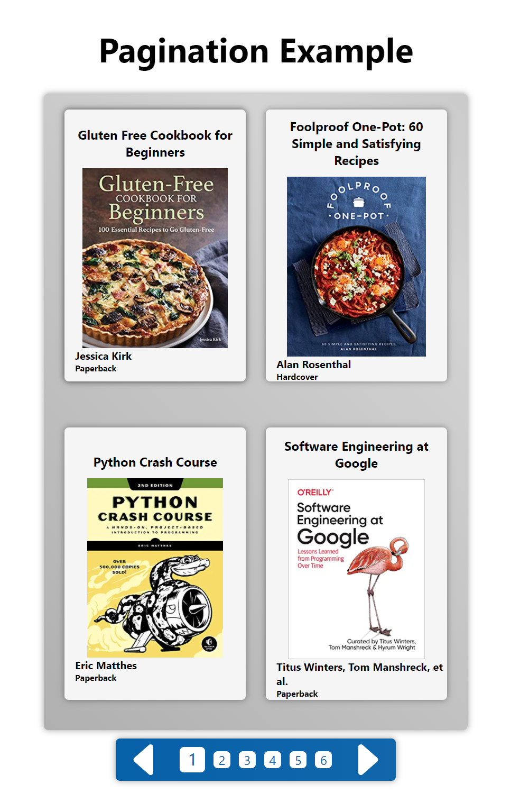
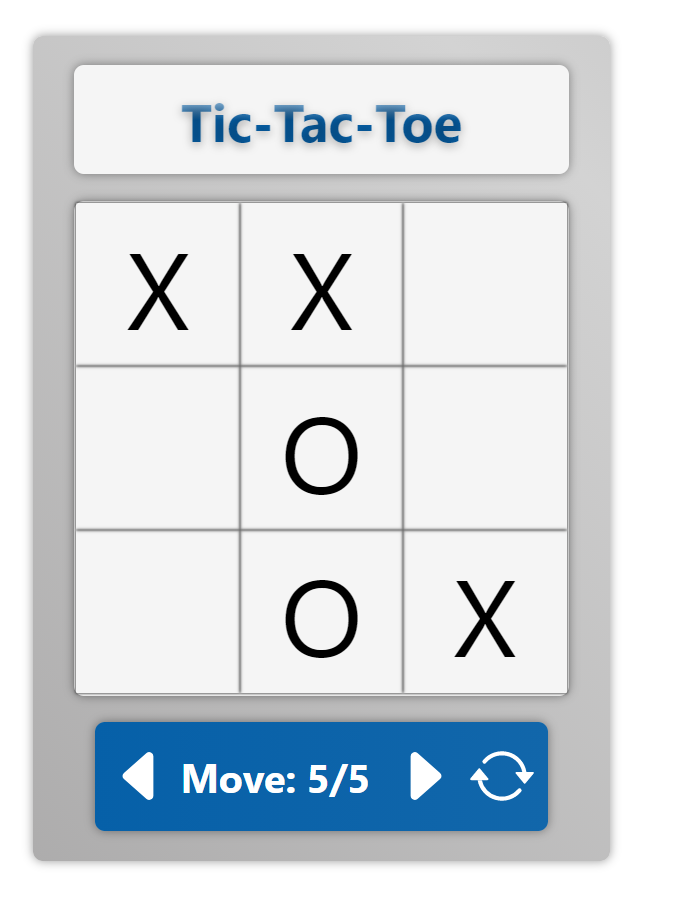

# JavascriptBasics
 Java Jan 2021

# Pagination Assignment
Create a web page with HTML, CSS(Or Bootstrap), Javascript(Or JQuery) andimplement a simple dynamic pagination functionality. The data can be a list of books with threeproperties: bookId, title, and authorName. You can mock the data inside a Javascript object.There should be 20 books and each page should show maximum 6 books/records. Thepagination links should not load a new page and must use Javascript to dynamically modify and update the DOM: (​https://www.w3schools.com/js/js_htmldom_document.asp​).

# React-Tac-Toe
Follow the React Website Guide "Tutorial: Intro to React – React".
(https://reactjs.org/tutorial/tutorial.html)

